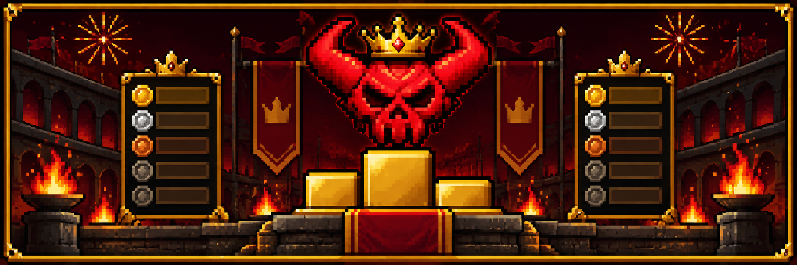
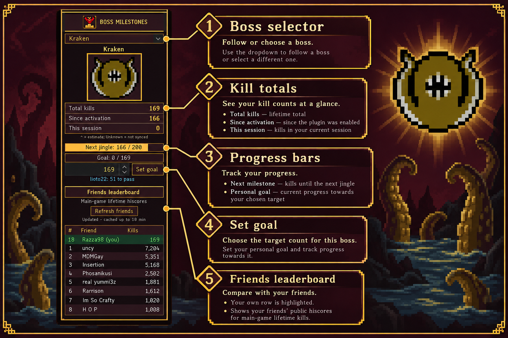
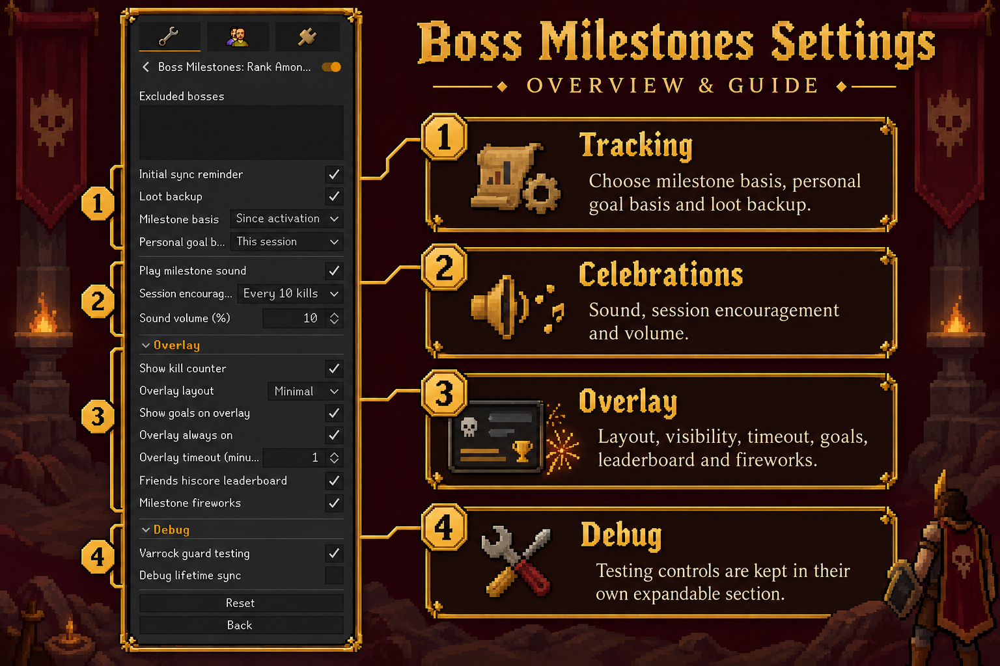

# Boss Milestones: Rank Among Friends

**Track the grind. Celebrate the milestones. See how you rank against your friends.**

Boss Milestones keeps a running record of your boss kills and gives the long grind something to celebrate. Follow your session, chase a personal target, and compare public hiscores with the friends you choose to include.

## At a glance

| Keep the count | Chase your next goal | Climb the friends board |
|:---:|:---:|:---:|
| Session, since-activation and lifetime boss totals | Personal targets, milestone jingles and in-game fireworks | Public boss hiscores for your RuneScape friends |

## Your panel, your progress

The themed side panel keeps the selected boss, your totals, next milestone and personal goal together. Open it to choose a boss, set a target or refresh the friends leaderboard.

*A visual guide to the side panel, using Kraken as the example.*

## Settings at a glance

Use the settings to choose how kills count, tune celebrations and shape the on-screen overlay. Testing controls stay in their own expandable **Debug** section.

*Tracking and celebration controls are followed by the expandable Overlay and Debug groups.*

## Milestones worth celebrating

Celebrations scale with the achievement: the first 10 and 25 kills get their own sounds, then bigger fanfares arrive at 250 and 1,000 kills. Personal goals have a celebration of their own, and optional session encouragement can keep shorter grinds lively. Fireworks spread across the game view when a milestone or personal goal is reached.

Choose whether milestones count **Since activation** (default), **This session**, or **All-time kills**. Personal goals have their own basis setting, so your goals can be independent of milestone celebrations. Changing a basis or syncing a total won’t replay old rewards.

## Make it yours

The expandable **Overlay** settings let you tune how much progress appears on screen and when it appears.

- Pick **Full**, **Compact** or **Minimal** layout.
- Show the overlay always, or let it hide after a configurable idle timeout.
- Choose whether to show personal goals on the overlay; the Minimal layout keeps the goal as a single extra line.
- Adjust celebration volume, optional session encouragement and milestone fireworks.
- Exclude bosses by entering comma-separated names, or enable loot backup for supported drops.
- Find testing and diagnostic controls in the separate **Debug** section.

## Getting started

1. Install **Boss Milestones: Rank Among Friends** from the RuneLite Plugin Hub.
2. Keep in-game boss kill-count messages enabled so kills can be tracked reliably.
3. Open the red skull and gold podium sidebar icon, then choose **Follow current boss** or select one from the list.
4. To sync a lifetime total, open that boss’s individual **Combat Achievements** details and look for the confirmation message.
5. Set a personal goal in the side panel. Enable **Friends hiscore leaderboard** in settings to compare with friends.

## Counters, sync and privacy

Session kills reset when you log out or disable the plugin; world hops preserve them. Since-activation and saved lifetime totals persist across restarts. A lifetime total shown as **Unknown** has not been synced or estimated yet; a `~` marks a loot-based estimate.

The friends leaderboard is **off by default**. When enabled, queried usernames are sent to the official OSRS hiscores service, which also receives your IP address. Scores are public main-game totals, cached for up to 10 minutes while the side panel is open; unavailable or unranked results are not counted as zero.

## Help and credits

Found an issue? [Open a GitHub issue](https://github.com/RYANOATES/Boss-Kill-Milestones/issues) with the boss name, what happened and a screenshot if possible.

[BSD-2-Clause licence](LICENSE) · [Asset notices and audio credits](ASSET-NOTICES.md)

*Thanks Cow and the Lucipurr boys for support and the idea.*
